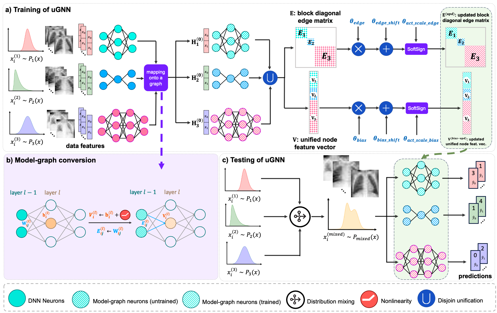

# uGNN: Unified Graphs for Heterogeneous Models

## Overview

uGNN turns ordinary neural nets (MLPs, CNNs, GNNs) into **graphs**—weights become **edges**, biases become **nodes**—then trains a **unified GNN** to operate over the disjoint union of these model-graphs. This lets heterogeneous architectures learn **together** in a **data heterogeneous** and **domain-fractured** environment.

#### (Accepted in PRIME, MICCAI 2025 Conference)

<!-- drop in your main figure -->



> **GNN-based Unified Deep Learning**
>
> Furkan Pala and Islem Rekik
> 
> BASIRA Lab, Imperial-X and Department of Computing, Imperial College London, London, UK
>
> **Abstract:** *Deep learning models often struggle to maintain robust generalizability in medical imaging, particularly under domain-fracture scenarios where distributional shifts arise due to varying imaging techniques, acquisition protocols, patient populations, demographics, and equipment. In practice, each hospital may need to develop and train distinct models-differing in functionality (i.e., learning task) and morphology including width and depth-to handle their local data distributions. For example, while one hospital may utilize Euclidean architectures such as MLPs and CNNs to process structured tabular data or regular grid-like image data, another hospital may need to deploy non-Euclidean architectures such as graph neural networks (GNNs) to process inherently irregular data like brain connectomes or other graph-structured biomedical information. However, how to train such heterogeneous models coherently across different datasets, in a manner that enhances the generalizability of each model, remains an open and challenging problem. In this paper, we address this issue by introducing a new learning paradigm, namely unified learning. To address the topological differences between these heterogeneous architectures, we first encode each model into a graph representation, enabling us to unify these diverse models within a shared graph learning space. Once represented in this space, a GNN guides the optimization of the unified models. By decoupling the parameters of individual deep learning models and controlling them through the unified GNN (uGNN), our approach enables parameter-sharing and knowledge-transfer across varying architectures (MLPs, CNNs and GNNs) and distributions, ultimately improving its generalizability. We evaluate our framework on MorphoMNIST and two MedMNIST benchmarks-PneumoniaMNIST and BreastMNIST-and find that our unified learning improves the performance of individual models when trained on unique distributions and tested on mixed ones, thereby demonstrating generalizability to unseen data with strong distributional shifts.*


---

## Project Structure
```
ugnn/
├─ README.md
├─ pyproject.toml
├─ requirements.txt
├─ setup.cfg
├─ ugnn
│  ├─ __init__.py
│  ├─ utils
│  │  ├─ __init__.py
│  │  ├─ logging.py
│  │  ├─ seed.py
│  │  └─ misc.py
│  ├─ data
│  │  ├─ __init__.py
│  │  ├─ idxio.py
│  │  ├─ datasets.py
│  │  └─ loaders.py
│  ├─ models
│  │  ├─ __init__.py
│  │  ├─ mlp.py
│  │  ├─ cnn.py
│  │  └─ ugnn.py
│  ├─ graphs
│  │  ├─ __init__.py
│  │  ├─ convert.py
│  │  └─ unify.py
│  ├─ train
│  │  ├─ __init__.py
│  │  ├─ train_ugnn.py
│  │  └─ train_baseline.py
│  └─ eval
│     ├─ __init__.py
│     └─ evaluate.py
└─ scripts
   ├─ train_ugnn_ws.py
   ├─ train_baseline.py
   └─ test_ugnn.py
```

- `ugnn/models`: CNN/MLP baselines + uGNN variants (`UGNN`, `UGNN_WS`, `UGNNModelSpecific`)
- `ugnn/graphs`: model→graph conversion (`convert.py`) and multi-model unification (`unify.py`)
- `ugnn/data`: MedMNIST/MorphoMNIST-style datasets, loaders, and IDX helpers
- `ugnn/train` / `ugnn/eval`: training loops and evaluation utilities
- `scripts/`: CLI entry points for training/testing

---

## Setup

### 1) Create and activate a virtual environment

```bash
python3 -m venv .venv
source .venv/bin/activate
```

### 2) Install dependencies
```bash
pip install -r requirements.txt
```

PyTorch Geometric has CUDA-specific wheels. If you need a specific CUDA build, install PyTorch first from https://pytorch.org/get-started/locally/ and then:
pip install torch-geometric

### 3) (Optional) Editable install

If you want to `import ugnn` anywhere:
```bash
pip install -e .
```
---

## Data

### MedMNIST (PathMNIST example)

The scripts will auto-download via `medmnist`. To create a **distribution shift** split used by uGNN (clusters), place your cluster index arrays here (or in the project root) as:
```
PathMNIST_cluster0.npy
PathMNIST_cluster1.npy
PathMNIST_cluster2.npy
```
Each `.npy` holds integer indices into the **train** split specifying which examples belong to a given cluster. Example shape: `(N_i,)`.

> You control how clusters are formed (e.g., k-means in feature space, pathology groups, random shards). The training script only needs these index files.

---

## Quick Start

### Baseline training (single model)

Train one of the baselines on the clustered training batches:
```bash
python scripts/train_baseline.py \
  --seed 42 \
  --batch-size 1024 \
  --epochs 200 \
  --model-idx 2 \
  --lr 0.05 \
  --outdir outputs
```
- `--model-idx` chooses which baseline architecture to train (as instantiated in the script):  
  - `0`: `CNNClassifierDeep(in_channels=3, num_classes=9)`  
  - `1`: `CNNClassifier(in_channels=3, num_classes=9)`  
  - `2`: `MLPClassifier(3*28*28, [100, 50, 20], 9)`

Artifacts:
- Weights → `outputs/baseline_model_{model-idx}.pt`
- Metrics JSON → `outputs/baseline_model_{model-idx}_metrics.json`

### uGNN (weight-sharing) training

Train the unified GNN that operates on the **disjoint union** of all model-graphs:
```bash
python scripts/train_ugnn_ws.py \
  --seed 42 \
  --batch-size 1024 \
  --epochs 200 \
  --dataset pathmnist \
  --num-clusters 3 \
  --lr 0.05 \
  --k-edge-theta 5000000 \
  --k-bias-theta 1000000 \
  --act softsign \
  --scale 1.5 \
  --outdir outputs
```
Artifacts:
- uGNN snapshot → `outputs/ugnn_ws.pt`
- Best-per-model graph states (edge_attr/bias buffers) →  
  `outputs/ugnn_ws_graph_{1,2,3}_best_f1.pt`
- Full training metrics → `outputs/ugnn_ws_metrics.json`

### Test the trained uGNN

Evaluate the uGNN on the test split:
```bash
python scripts/test_ugnn.py --weights outputs/ugnn_ws.pt
```
This prints per-model weighted precision/recall/F1 as JSON.

---

## What’s Happening Under the Hood?

- **Graphification** (`ugnn/graphs/convert.py`):  
  - **MLP**: Linear -> edges (weights), out neurons -> nodes (bias), ReLU flags.  
  - **CNN**: Conv kernels unrolled into edges indexed by `(layer, out_c, in_c, k_i, k_j)`.  
- **Unification** (`ugnn/graphs/unify.py`):  
  - Stitches multiple model-graphs into a single `torch_geometric.data.Data`.  
  - Keeps track of per-edge kernel IDs for **weight-sharing** grouping (`UGNN_WS`).  
- **uGNN forward** (`ugnn/models/ugnn.py`):  
  - Writes each model’s input activations into its input nodes.  
  - Runs message passing per-layer slice; applies learned θ groups to edges/biases.  
  - Reads off each model’s output nodes to compute per-model losses.

---

## Reproducibility

- Set seeds with `--seed` (default 42).  
- Determinism toggled in `ugnn/utils/seed.py`.  
- Batch shuffling seeds are passed to PyTorch `DataLoader`s.

---

## Typical Workflows

### A) Train a baseline, then uGNN

1) Prepare cluster files: `PathMNIST_cluster{0,1,2}.npy`  
2) Train a baseline model (e.g., MLP `model-idx=2`)  
3) Train uGNN with the same cluster files  
4) Test uGNN on the global test split

### B) Swap in your own models

- Add your architecture in `ugnn/models/`  
- Extend `ugnn/graphs/convert.py` to map it to a graph  
- Register in `scripts/train_ugnn_ws.py` model list

---

## Command Reference

### `scripts/train_baseline.py`
--seed INT              # RNG seed
--batch-size INT        # batch size (default: 1024)
--epochs INT            # max epochs (default: 200)
--model-idx {0,1,2}     # which predefined baseline to train
--lr FLOAT              # learning rate (default: 0.05)
--outdir PATH           # output directory (default: outputs)

### `scripts/train_ugnn_ws.py`
--seed INT
--batch-size INT
--epochs INT
--dataset {pathmnist}   # currently PathMNIST is wired
--num-clusters INT      # number of cluster index files
--lr FLOAT
--k-edge-theta INT      # number of θ groups for edges (weight-sharing)
--k-bias-theta INT      # number of θ groups for biases
--act {relu,softsign,scaled_tanh,scaled_softsign,...}
--scale FLOAT           # scale for scaled activations
--outdir PATH

### `scripts/test_ugnn.py`
--weights PATH          # load uGNN state_dict (optional)

---

## Requirements

Install via:
pip install -r requirements.txt

Key libs:
- `torch`, `torchvision`, `torch-geometric`
- `medmnist`, `numpy`, `tqdm`, `scikit-learn`, `matplotlib`, `networkx`

> GPU strongly recommended for uGNN_WS, especially with large `k_edge_theta`.

---

## Troubleshooting

- **“No module named torch_geometric”**  
  Install PyTorch first (CUDA-matched), then `pip install torch-geometric`.

- **OOM during uGNN training**  
  Reduce `--batch-size`, or lower `--k-edge-theta` / `--k-bias-theta`.

- **Cluster file not found**  
  Ensure `PathMNIST_cluster{0..K-1}.npy` exist and index into the **train** set.

- **Metrics look frozen**  
  Try a smaller LR (`--lr 0.005`) or use `relu` activation in the uGNN.

---

## Citation

If this repository is useful in your research, please cite:
@article{ugnn2025,
  title={GNN-based Unified Deep Learning},
  author={Furkan Pala, Islem Rekik},
  journal={arXiv preprint},
  year={2025}
}
